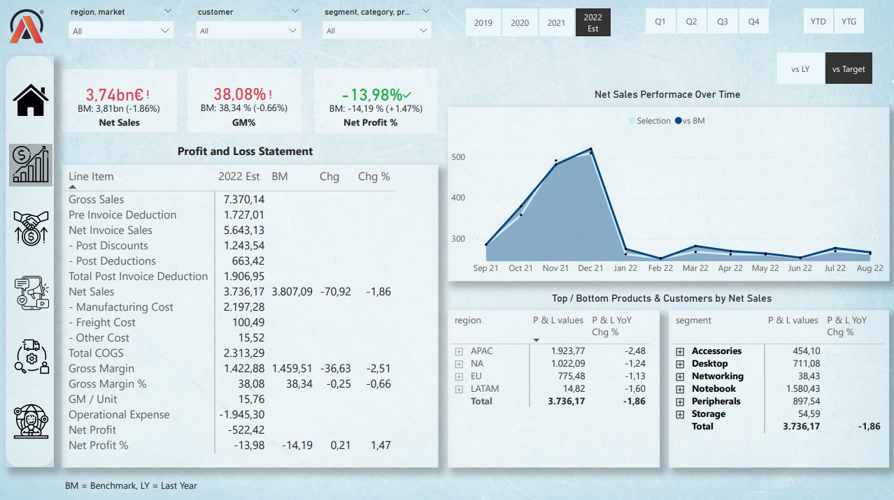
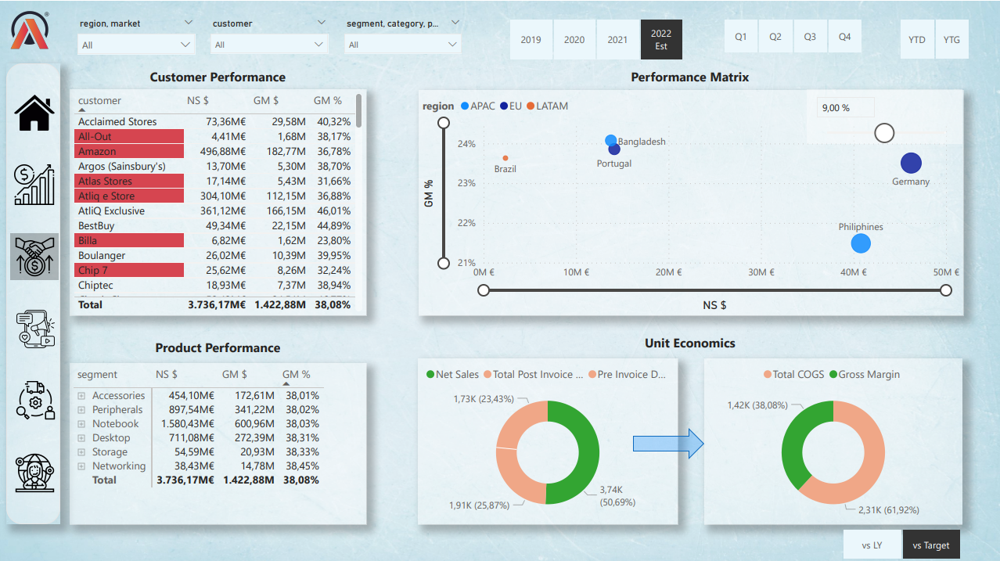
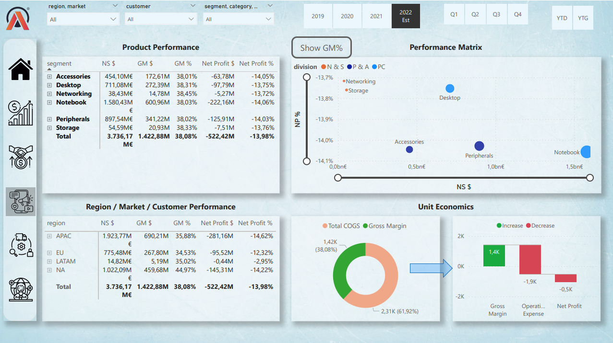
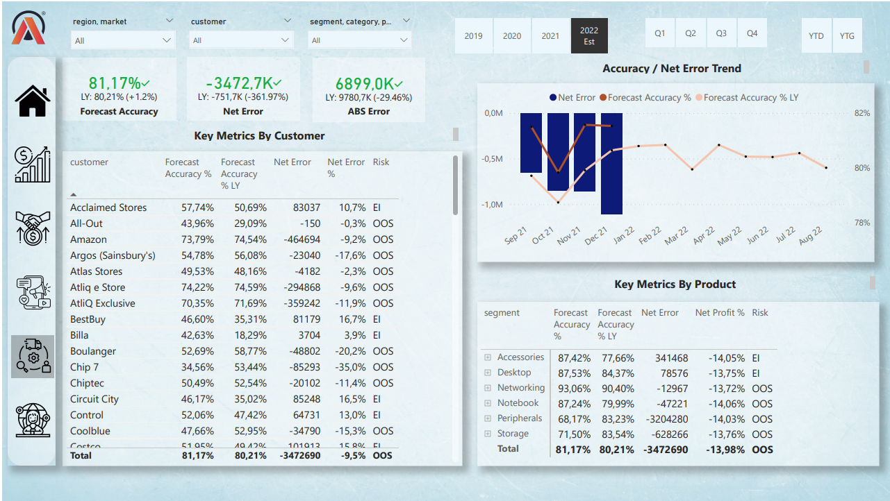

# Business 360

## Project Overview

AtliQ Hardware is a rapidly growing company venturing into data analytics using Power BI for the first time. The primary objective is to surpass competitors in the market and enable data-driven decisions across finance, sales, marketing, and supply chain domains. This readme.md provides an overview of the project, technical stacks used, techniques learned, business-related terms, and important considerations for stakeholders.

## Tech Stacks

- **SQL**
- **Power BI Desktop**
- **Excel**
- **DAX language**
- **DAX Studio** (for optimizing the report)

## Power BI Techniques Learned

- Asking relevant questions
- Creating calculated columns and measures using DAX language
- Data modeling
- Using bookmarks for visual switching
- Page navigation with buttons
- Handling zero division errors with the divide function
- Creating a date table using M language
- Dynamic titles based on applied filters
- Using KPI indicators and conditional formatting
- Data validation techniques
- Power BI services, publishing, and auto-refresh setup
- Power BI App creation
- Collaboration, workspace, and access permissions

## Business Related Terms

- Gross price
- Pre-invoice deductions
- Post-invoice deductions
- Net invoice sale
- Gross Margin
- Net sales
- Net profit
- COGC - Cost of Goods Sold
- YTD - Year to Date
- YTG - Year to Go
- Direct, Retailer, Distributors, Consumer

## Company's Background

AtliQ Hardware has experienced significant growth globally, selling computers and accessories through retailers, direct sales, and distributors. The decision to build an analytics team follows unexpected losses from a store in America. The project aims to help the company make data-driven decisions.

## Questions to Ask Before Starting with Dashboard

- Objective of the Power BI dashboard
- Success measurement criteria
- Project deadline
- Stakeholder expectations and fears
- Intended users and purposes
- Preview before release
- Stakeholder input on design and views
- Potential challenges and resources needed
- Stakeholder hopes and expectations

## Dataset Understanding

- Dimension table (customer, product details)
- Fact table (transactional data)
- Markets, sub-zones, regions, platforms, and channels
- Forecast and sales data
- Tables related to freight cost, gross price, manufacturing cost, pre-invoice deductions, and post-invoice deductions

## Importing Data into Power BI

Datasets are imported from a MySQL database to Power BI using provided database access credentials.

## Data Model

Data modeling is crucial for optimal report performance. Good data modeling practices are followed to build a strong foundation.

  

## Dashboard Designing

Based on mock-ups, the team designs visuals and creates measures for multiple views, including Info, Finance, Sales, Marketing, Supply Chain, Executive, Products, and Support.

## Finance View

  

## Sales View

  

## Marketing View

  

## Supply chain View

  

## Executive View

  

## Project Outcome

The Power BI report facilitates data-driven decision-making, providing insights and answering questions across various domains. Stakeholders gain the ability to make informed choices and understand the "why" behind different situations.

